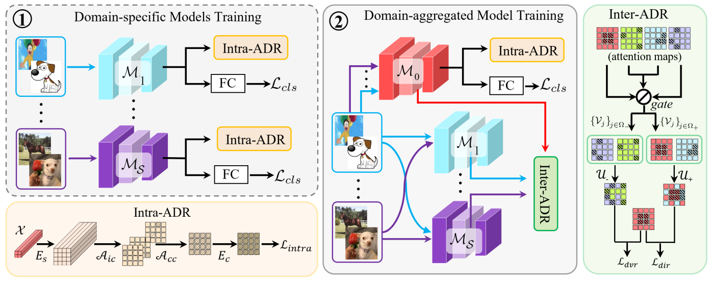

# Attention Diversification for Domain Generalization

This repo is the official implementation of ECCV2022 paper "Attention Diversification for Domain Generalization".

## Introduction

The pipeline of our proposed Attention Diversification framework is composed of Intra-Model Attention Diversification Regularization (Intra-ADR) and Inter-Model Attention Diversification Regularization (Inter-ADR). Intra-ADR is utilized to coaesely recall task-related features as much as possible, and then Inter-ADR is exploited to delicately distinguish domain- and task-related features for further suppression and enhancement respectively.

This code is based on [Dassl.pytorch](https://github.com/KaiyangZhou/Dassl.pytorch), the `Intra-ADR` and `I2-ADR` module are easily to implement, and the two modules' code can be found in `./dassl/engine/intra_adr.py` and `./dassl/engine/i2_adr.py` respectively. 



## Preparation

**Prerequistes**

- Python 3.8
- Pytorch 1.12
- CUDA 11.0 
- yacs
- gdown

## Usage
### Data Preparation
* **PACS**: Download data from website [PACS](https://dali-dl.github.io/project_iccv2017.html)
* **OfficeHome**: Download data from website [OfficeHome](https://www.hemanthdv.org/officeHomeDataset.html)

put your dataset in ./datasets/

### Data folds structure
  ```shell
  ./datasets/
    └── PACS/
    |      ├── art_painting
    |      |      └── ...
    |      ├── cartoon
    |      |      └── ...
    |      ├── photo
    |      |      └── ...
    |      ├── sketch
    |      |      └── ...
    |      ├── art_painting_crossval_kfold.txt
    |      ├── art_painting_test_kfold.txt
    |      ├── art_painting_train_kfold.txt
    |      ├── cartoon_crossval_kfold.txt
    |      └── ...
    └── officehome/
    |      ├── art
    |      |      ├── train
    |      |      |    └── ...
    |      |      └── val
    |      ├── clipart
    |      |      └── ...
    |      ├── product
    |      |      └── ...
    |      └── real_world
    |             └── ...
    
  ```

### ImageNet pretrained model
To perform domain generalization in PACS, please run,

Put ImageNet pretrained model in ./pretrain

#### Run I2-ADR (Intra-ADR+Inter-ADR)
```bash
# PACS | I2-ADR + MixStyle
bash run_i2.sh pacs

# PACS | I2-ADR + MixStyle
bash run_i2.sh office_home_dg
```

#### Run Intra-ADR module
```bash
# PACS | Intra-ADR + MixStyle
bash scripts/run_intra.sh pacs 

# OfficeHome | Intra-ADR + MixStyle
bash scripts/run_intra.sh office_home_dg
```

## Citation
Please consider citing our paper if you find it useful for your research.

```BibTeX
@inproceedings{meng2022attention,
    title={Attention Diversification for Domain Generalization},
    author={Rang Meng, Xianfeng Li, Weijie Chen, Shicai Yang, Jie Song, Xinchao Wang, Lei Zhang, Mingli Song, Di Xie, Shiliang Pu},
    booktitle={European Conference on Computer Vision (ECCV)},
    year={2022},
}
```

## License
This project is released under the [Apache 2.0 license](./LICENSE). Other codes from open source repository follows the original distributive licenses.

## Acknowledgement
This repo is built using [Dassl.pytorch](https://github.com/KaiyangZhou/Dassl.pytorch). 

## Contact Information
For help or issues using this repo, please submit a GitHub issue.

For other communications related to this repo, please contact Rang Meng (`mengrang-at-hikvision.com`), Xianfeng Li (`lixianfeng6-at-hikvision.com`).
